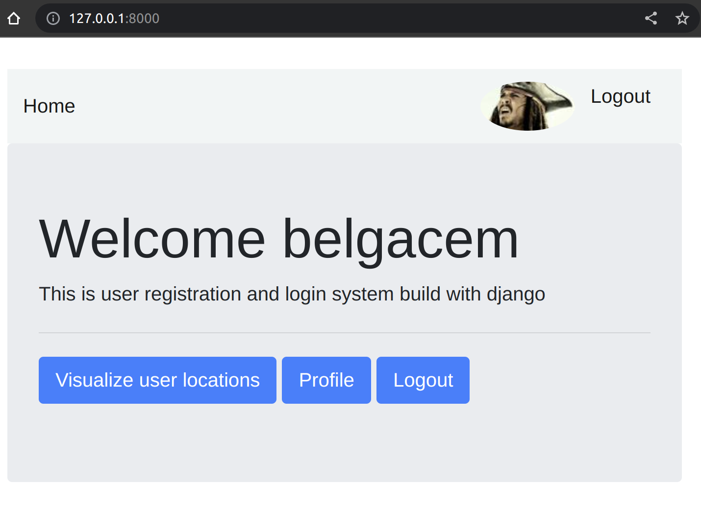
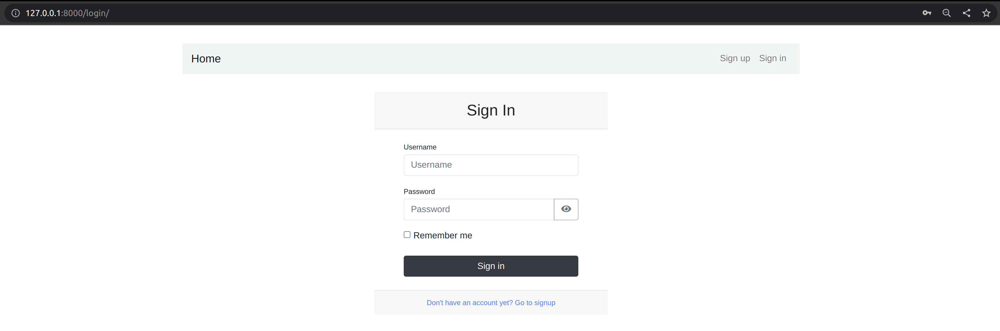
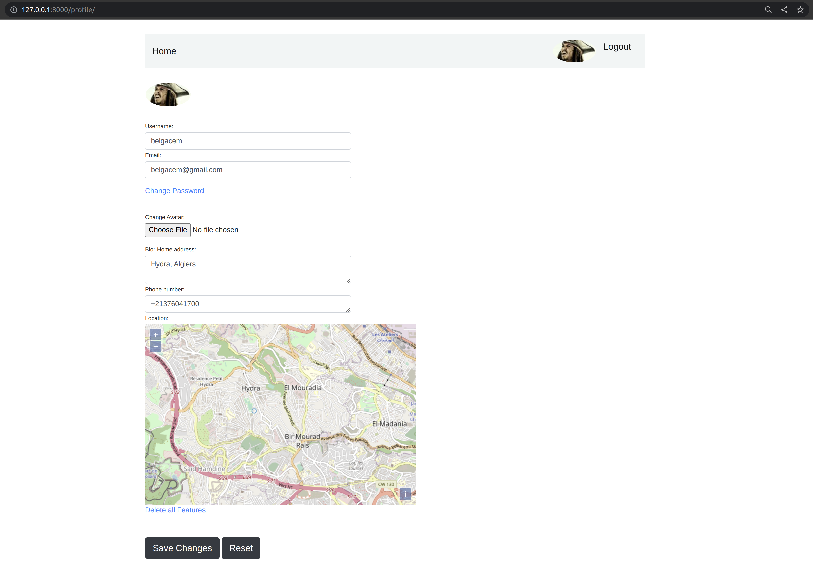
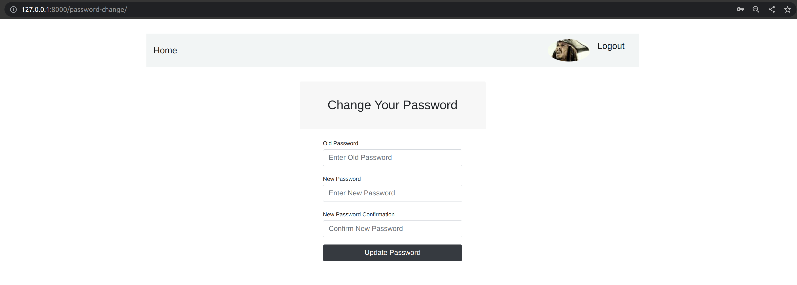
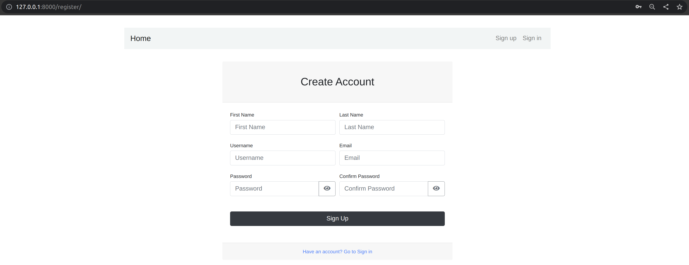
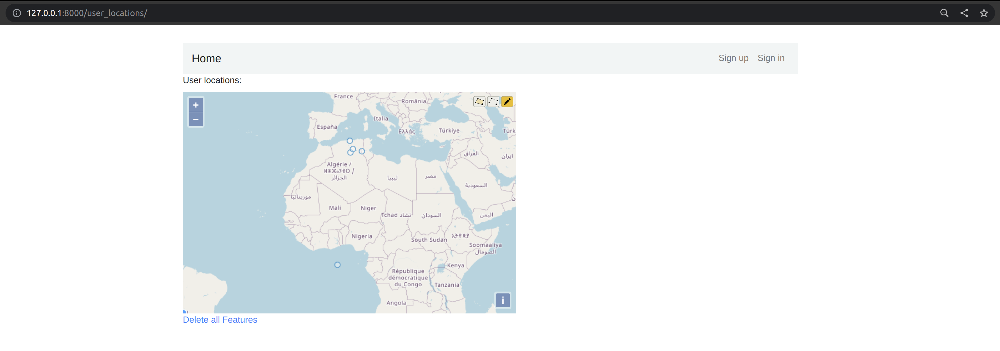
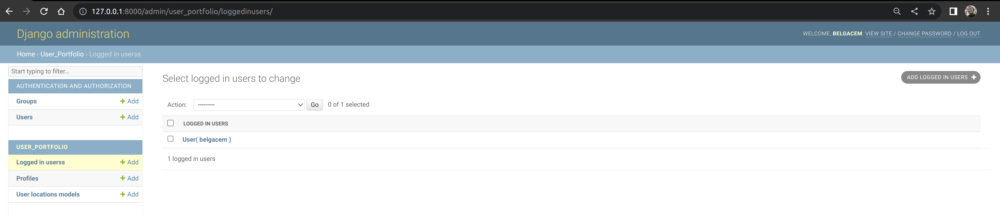

# Description
This is a user portfolio project made to demonstrate use of django framework

# Dependencies requirements
### To run this project, you need to have python installed properly and then install django framework and necessary libraries for django gis extensions:

    pip install django 
    sudo apt-get install binutils libproj-dev gdal-bin
    pip install psycopg2-binary

### To setup the database system, you need to have docker set up properly. The following command will download the docker image of kartoza/postgis and run a container for that image

    sudo docker run --name=postgisKartozaTestContainer -d -e POSTGRES_USER=user001 -e POSTGRES_PASS=123456789 -e POSTGRES_DBNAME=gis -p 1111:5432 kartoza/postgis

### To stop the container then start it again, you can use the following 2 commands:

    sudo docker container stop postgisKartozaTestContainer
    sudo docker container start postgisKartozaTestContainer

# Running the project
### When the docker container is setup correctly and all the requirements are satisfied, you can create superuser for the website with the command

    python manage.py createsuperuser

### Run the following commands to setup the database properly

    python manage.py makemigrations
    python manage.py migrate

### If you get an error at this step make sure that your docker container is running: 

    sudo docker container start postgisKartozaTestContainer

### To run the server, execute:

    python manage.py runserver

### To visit the website, go to http://127.0.0.1:8000/ 

# Website capabilities:
This website is able to register users, login & logout operations. Each user has an editable profile and can change his password. In the user profile, the user can select its position on the map and it will be saved as one of the profile fields.

In the home page there is a button that takes you to a page were you can visualize the position of every user on the map.

## Home page before login:

## Home page after login:

## User login page:

## User profile page:
When the user clicks on his profile picture or clicks on the profile button on the home page, the user profile page shows up:

The user can change username, email, home address & phone number. He can also upload his avatar picture (like captain Jack Sparrow face) and choose his position on the map.
When save changes button is clicked, the changes will be saved. The reset button will reset the fields with their original values.
The change password button is for changing the user password and it will redirect to the change password page.

 ## Change password page:
 

 ## Register user page:
 
 After registering the user is automatically logged in and redirected to his profile page so that hw can fill his informations.

 ## User locations page
 This page shows the geographical position of every user on the map as points
 

## Admin logged in users montioring:
In the admin page a model was added to monitor users that are currently logged in:

# Testing
### To test the project, you can run the following command
    python manage.py test
